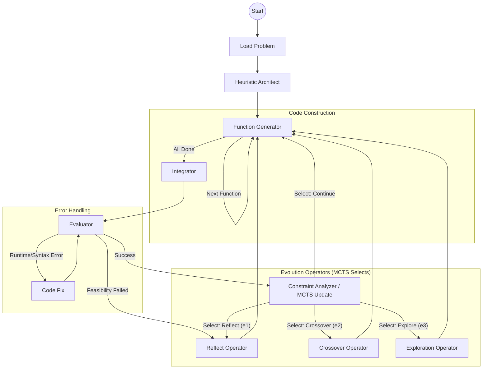

# sysevo 系统工作流与架构设计

## 1. 系统概览 (Overview)
sysevo 是一个基于增强型大型语言模型的多智能体协作系统。该系统利用 LangGraph 框架构建了一个闭环的自动化工作流，并结合蒙特卡洛树搜索 (MCTS) 算法作为核心策略引擎，指导启发式算法代码的生成与演化。系统的目标是在广阔的代码解空间中，自动搜索并优化出针对特定组合优化问题的高性能求解器。

## 2. 核心架构 (Core Architecture)

系统由多个功能专一的智能体节点 (Agent Nodes) 构成，这些节点通过有向状态图 (State Graph) 进行连接与交互。

### 2.1 关键节点定义 (Key Nodes)

#### 由于 MCTS 驱动的算子 (Operators)
这些节点代表了系统演化搜索的不同动作：
*   **Heuristic Architect (初始架构师):** 系统的入口点。负责阅读问题描述，设计初始的启发式算法软件架构（定义所需的函数列表、功能描述及接口），而不直接编写实现代码。
*   **Reflect (e1 - 反思算子):** 基于上一轮评估产生的质量报告 (Quality Report) 和代码实现，反思性能瓶颈或逻辑缺陷，生成“经验教训”并调整函数设计，指导下一轮优化。
*   **Crossover (e2 - 交叉算子):** (概念性) 利用 MCTS 树中历史优秀解的特征（如保留高效的函数实现），与其他解的特征进行融合，产生新的后代。
*   **Exploration (e3 - 探索算子):** 在解空间陷入局部最优时，负责跳出当前思维框架，尝试全新的算法架构或实现思路。

#### 执行工节点 (Workers)
这些节点负责具体的代码生产、组装和验证：
*   **Generate Function (代码生成器):** 接收来自架构师或演化算子的指令，逐个生成启发式函数的 Python 源代码。拥有自我循环机制，直至所有规划的函数生成完毕。
*   **Integrate (集成器):** 这是一个确定性工具节点（非 LLM）。负责将零散生成的函数代码，按照依赖关系和类结构，物理集成到 `ModelSolver` 模板中，输出完整的可执行文件。
*   **Evaluate (评估器):** 运行集成的求解器，执行基础测试。负责捕获语法错误 (Syntax Error)、运行时错误 (Runtime Error) 以及可行性检查 (Feasibility Check)。
*   **Code Fix (修复器):** 当评估器发现代码报错时被激活。它利用 LLM 的代码理解能力，结合 Traceback 信息自动修复具体的函数实现。
*   **Constraint Analyzer (分析与决策器):** 系统闭环的关键。
    1.  对运行成功的求解器进行多实例大规模测试。
    2.  分析约束满足情况和目标函数值，计算奖励 (Reward)。
    3.  更新 MCTS 搜索树状态 (Backpropagation)。
    4.  根据 UCT (Upper Confidence Bound for Trees) 策略选择下一个动作 (Selection)，决定流程流向哪个演化算子。

## 3. 工作流详述 (Workflow Description)

sysevo 的工作流设计为一个带有自我纠错和持续进化能力的循环结构。

### Phase 1: 初始化 (Initialization)
流程始于 `Load Problem` 节点，系统加载目标问题的详细描述、数学模型及代码环境配置。

### Phase 2: 架构设计与生成 (Architecture & Generation)
1.  **架构设计:** `Heuristic Architect` 分析问题，输出一份 JSON 格式的 `Function Architecture`，列出解决问题所需的所有启发式组件。
2.  **代码生成:** 流程进入 `Generate Function`。
    *   该节点是一个自循环结构。
    *   它根据架构列表，一次生成一个函数。
    *   生成的代码被存储在状态记忆中。
    *   循环直至所有函数生成完毕。

### Phase 3: 集成与验证 (Integration & Verification)
1.  **集成:** `Integrate` 节点将所有函数“组装”进主求解器模板。同时，它会将当前的基因信息（代码 + 架构）持久化保存，为 MCTS 的回溯提供数据。
2.  **评估:** `Evaluate` 节点尝试运行求解器。
    *   **Case A (Error):** 若发生报错，流转至 `Code Fix` 节点修复，然后跳回 `Evaluate` 重测。
    *   **Case B (Feasibility Fail):** 若代码运行通畅但结果不可行（违反硬约束），这被视为严重的逻辑设计失误，流程可能直接触发 `Reflect` 进行反思。
    *   **Case C (Success):** 若通过基础测试，流转至 `Constraint Analyzer`。

### Phase 4: MCTS 演化闭环 (The Evolution Loop)
这是 sysevo的核心逻辑。
1.  **分析:** `Constraint Analyzer` 运行更严格的测试集，量化求解器质量。
2.  **MCTS 更新:** 计算出的评分（Reward）被反向传播更新至 MCTS 搜索树的对应节点。
3.  **决策:** MCTS 算法根据探索与利用 (Exploration vs Exploitation) 的平衡，选择下一个最优动作。
    *   如果需要改进当前解 -> 路由至 **Reflect**。
    *   如果需要融合历史优良基因 -> 路由至 **Crossover**。
    *   如果尝试新方向 -> 路由至 **Exploration**。
    *   或者继续在当前分支从现有状态生成 -> **Generate Function**。
    
这些算子节点执行完毕后，都会再次指向 `Generate Function` 或 `Integrate`，从而开启新一轮的生成-验证循环。

## 4. 架构流程图 (Architecture Diagram)

## 5. 设计亮点
*   **Code-Architecture Separation:** 将架构设计与代码实现解耦，使 LLM 能先专注于高层逻辑。
*   **MCTS Guidance:** 摒弃了传统的随机尝试或简单的线性迭代，利用 MCTS 在解空间中构建搜索树，有效平衡了对高性能解的“利用”和对未知结构的“探索”。
*   **Self-Healing:** 内置的 Fix Loop 确保了生成的求解器具有较高的鲁棒性，减少因简单语法错误导致的评估中断。
